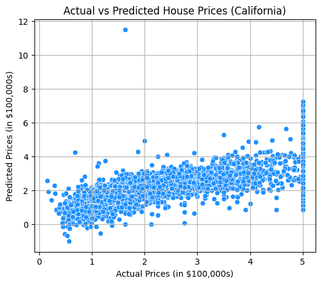

# 🏠 California House Price Prediction using Linear Regression

## 📘 Overview
This project predicts **median house prices** in California using the **California Housing Dataset** from Scikit-learn.  
It uses a **Linear Regression model** to estimate housing values based on features like income level, average rooms, population, and location coordinates.

---

## 🧠 Dataset Information
**Dataset:** California Housing Dataset  
**Samples:** 20,640  
**Features:**
- `MedInc`: Median income in block group  
- `HouseAge`: Median age of houses  
- `AveRooms`: Average number of rooms per household  
- `AveBedrms`: Average number of bedrooms per household  
- `Population`: Block group population  
- `AveOccup`: Average household occupancy  
- `Latitude`: Latitude coordinate  
- `Longitude`: Longitude coordinate  
- `MedHouseVal`: Median house value (Target variable)

---

## ⚙️ Steps Involved
1. **Data Loading:** Load California housing dataset using `fetch_california_housing()`.  
2. **Preprocessing:** Split into train/test and scale features with `StandardScaler`.  
3. **Model Training:** Train a Linear Regression model.  
4. **Evaluation:** Calculate Mean Squared Error and R² score.  
5. **Visualization:** Plot actual vs predicted house prices.

---

## 📊 Results
| Metric | Value |
|--------|--------|
| Mean Squared Error | **0.56** |
| R² Score | **0.58** |
| Sample Predicted Price | **$377,000** |

---

## 📈 Visualization
The below plot shows the relationship between **actual** and **predicted** house prices:

---

